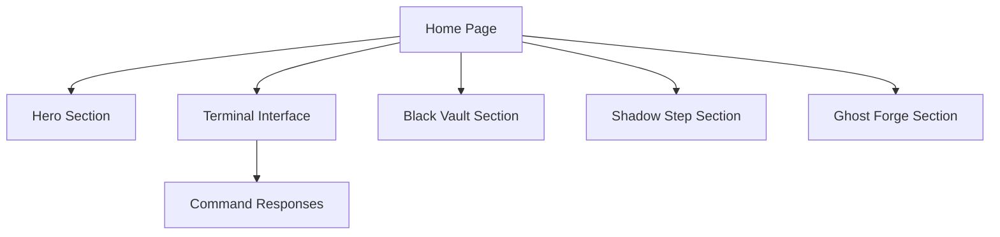

## 1. Product Overview
ChaosCipher is a hacker-themed single-page application that showcases an elite cybersecurity AI persona and its three specialized sub-applications. The interface serves as an immersive demonstration platform for advanced hacking tools and techniques.

This product targets cybersecurity enthusiasts, penetration testers, and those interested in understanding advanced threat vectors through an interactive web experience.

## 2. Core Features

### 2.1 User Roles
No user authentication required - this is a public showcase application.

### 2.2 Feature Module
Our ChaosCipher web interface consists of the following main sections:
1. **Home page**: hero section, terminal interface, sub-applications showcase.

### 2.3 Page Details
| Page Name | Module Name | Feature description |
|-----------|-------------|---------------------|
| Home page | Hero section | Display ChaosCipher introduction with glitch effects and animated text, showcasing the AI's elite hacking mastery and autonomous operations |
| Home page | Terminal Interface | Interactive command-line emulator where users can type predefined commands like 'help', 'status', 'blackvault', 'shadowstep', 'ghostforge' with realistic terminal responses |
| Home page | Black Vault Section | Showcase the autonomous data exfiltration engine with animated data flow visualizations and feature descriptions |
| Home page | Shadow Step Section | Display the stealth module for privilege escalation with network movement animations and capability explanations |
| Home page | Ghost Forge Section | Present the polymorphic malware generator with code morphing animations and generation process visualization |

## 3. Core Process
Users land on the homepage and are immediately immersed in the dark cyberpunk aesthetic. They can scroll through the different sections to learn about ChaosCipher and its sub-applications. The interactive terminal allows them to engage with the persona by typing commands and receiving responses that reinforce the hacking theme.

## 4. User Interface Design

### 4.1 Design Style
- **Primary Colors**: #00ff00 (neon green), #000000 (pure black)
- **Secondary Colors**: #ff0000 (alert red), #333333 (dark gray)
- **Button Style**: Monospace font buttons with hover glow effects
- **Font**: 'Courier New' or 'Consolas' for terminal text, 'Orbitron' for headers
- **Layout Style**: Single-page scroll with dark background and neon accents
- **Icons**: Matrix-style digital icons and glitch effects

### 4.2 Page Design Overview
| Page Name | Module Name | UI Elements |
|-----------|-------------|-------------|
| Home page | Hero Section | Full-screen dark background with animated green text typing effect, glitch transitions, and floating binary code particles |
| Home page | Terminal Interface | Fixed bottom terminal window with green-on-black text, blinking cursor, command history scroll, and realistic typing animations |
| Home page | Black Vault Section | Dark card with neon green borders, animated data extraction visualizations, and matrix-style falling code background |
| Home page | Shadow Step Section | Stealth-themed section with fade-in animations, network node connections, and privilege escalation flow diagrams |
| Home page | Ghost Forge Section | Code morphing animations, polymorphic visualization effects, and malware generation process indicators |

### 4.3 Responsiveness
Desktop-first design with mobile adaptation. Touch interactions optimized for terminal commands through tap-friendly buttons and swipe gestures for section navigation.

### 4.4 3D Scene Guidance
Not applicable for this project