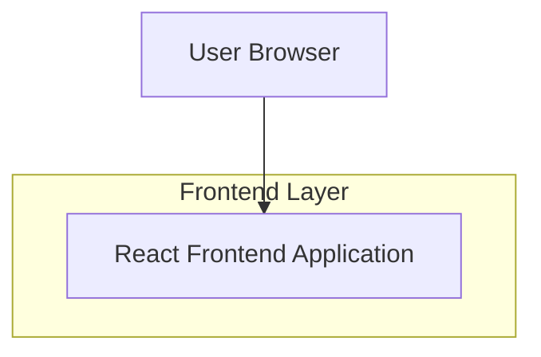

## 1. Architecture design

## 2. Technology Description
- Frontend: React@18 + tailwindcss@3 + vite
- Initialization Tool: vite-init
- Backend: None (static single-page application)

## 3. Route definitions
| Route | Purpose |
|-------|---------|
| / | Home page, displays the complete ChaosCipher interface with all sections |

## 4. API definitions
No backend APIs required - this is a static showcase application.

## 5. Server architecture diagram
Not applicable - client-side only application.

## 6. Data model
Not applicable - no database required for this showcase application.